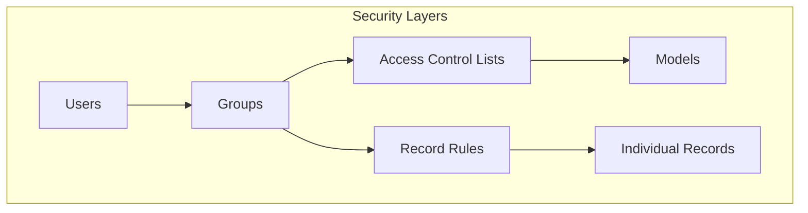

# Security

Access control and security definitions in web_tour.

## Access Control Lists (ACLs)

Model access permissions defined in:
- **[ir.model.access.csv](../web_tour/security/ir.model.access.csv)**
  - 2 model access rules

## Record Rules

Row-level security rules defined in:
- **[ir.rule.csv](../web_tour/security/ir.rule.csv)**

Security files overview:
- **[ir.model.access.csv](../web_tour/security/ir.model.access.csv)**
  - Model access permissions (CRUD rights)
- **[ir.rule.csv](../web_tour/security/ir.rule.csv)**
  - Record-level access rules

Notes
- Access Control Lists define which groups can access which models
- Record Rules provide row-level security (filter records by user/group)
- Security groups organize users and define permission sets
- All security is enforced at the ORM level by Odoo
